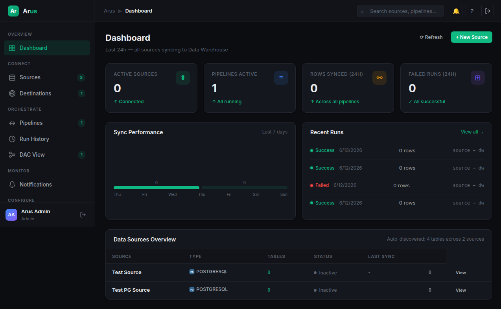

# Arus — Data Pipeline Platform

> _Data flows without the cluster._


*Arus Console — real-time dashboard with pipeline health, sync performance, and source overview*

Arus is a lightweight, self-hosted **CDC & ETL framework** purpose-built for teams running on VPS-class infrastructure (no Kubernetes). It ingests data from MySQL, MariaDB, PostgreSQL, and MongoDB sources, applies transformations, and lands them into a PostgreSQL, MySQL, or ClickHouse data warehouse — with a visual DAG interface for monitoring and troubleshooting.

---

## Why Arus?

| vs Airbyte | vs Debezium | vs Custom Scripts |
|---|---|---|
| No Kubernetes needed | No Kafka needed | Built-in DAG UI |
| Single `docker-compose.yml` | Single `docker-compose.yml` | Watermark tracking |
| Python-native connectors | Python-native connectors | Auto-retry + alerting |
| Runs on 2-core / 4GB RAM | Runs on 2-core / 4GB RAM | Schema drift detection |

---

## Key Features

| Feature | Status |
|---|---|
| **Source Connectors**: MySQL, MariaDB, PostgreSQL, MongoDB | ✅ Phase 1 |
| **Destination Connectors**: PostgreSQL, MySQL, ClickHouse | ✅ Phase 1 |
| **Watermark-based Incremental Sync** | ✅ Phase 1 |
| **Full Refresh & Backfill** | ✅ Phase 2 |
| **Pipeline Scheduling** (APScheduler cron) | ✅ Phase 1 |
| **Retry with Exponential Backoff** (tenacity) | ✅ Phase 2 |
| **Dead Letter Queue** for failed rows | ✅ Phase 2 |
| **Data Quality Checks** (row count, null checks) | ✅ Phase 2 |
| **Schema Drift Detection** with auto-ALTER | ✅ Phase 2 |
| **Soft-Delete Reconciliation** | ✅ Phase 2 |
| **Pipeline Dependency Resolution** | ✅ Phase 2 |
| **Transform Engine** (built-in steps + Python scripts) | ✅ Phase 2 |
| **Web Console** — Dashboard, DAG View, Run History | ✅ Phase 1 |
| **JWT Authentication** — Admin/Editor/Viewer roles | ✅ Phase 1 |
| **Notification Targets** — Telegram, Discord, Slack | ✅ Phase 2 |
| **CLI Tools** (`arusctl`) | 🔄 Phase 3 |

---

## Architecture at a Glance

```
                    Docker Host
                    ┌─────────────────────────────────────────┐
                    │  arus-console    arus-api               │
                    │  :8082 (nginx)   :8081 (FastAPI)        │
                    │       │               │                  │
                    │       └───────┬───────┘                  │
                    │               ▼                          │
                    │  arus-db (PostgreSQL)                    │
                    │  ├─ arus_config.*    (auth, sources,     │
                    │  │                   pipelines, settings)│
                    │  ├─ arus_state.*     (watermarks)        │
                    │  ├─ arus_run_logs.*  (run history)       │
                    │  ├─ staging.*        (raw landing zone)  │
                    │  └─ analytics.*      (normalized tables) │
                    └─────────────────────────────────────────┘
```

---

## Data Flow

```
Source DB ──→ [Batch SELECT with watermark]
                ──→ Python dict[]
                ──→ [Column type mapping]
                ──→ [Raw JSONB to staging.*_raw]  (if raw mode)
                ──→ [Extract typed columns]
                ──→ [Normalize]
                ──→ [Upsert to analytics.*]
                ──→ [Update arus_state watermark]
```

---

## Quick Start

```bash
# Get the docker-compose.yml from the docs site
# Then start all services
docker compose up -d

# Access the console
open http://localhost:8082

# Default credentials
# Email: admin@arus.io
# Password: admin123
```

---

## Documentation Structure

| Document | Description |
|---|---|
| [Architecture](architecture.md) | System design, component interaction, data flow |
| [Quickstart](quickstart.md) | Installation, configuration, first pipeline |
| [Configuration](configuration.md) | Environment variables, runtime settings reference |
| [Connectors](connectors.md) | Source/destination connector framework guide |
| [Pipelines](pipelines.md) | Pipeline orchestration, scheduling, transforms |
| [API Reference](api.md) | REST API endpoint documentation |
| [Console Guide](console.md) | Web UI feature walkthrough |
| [Data Model](datamodel.md) | Database schema, tables, relationships |
| [Development](development.md) | Setting up dev environment, testing, contributing |
| [Deployment](deployment.md) | Production deployment, scaling, security |

---

## Project Status

- **Phase 1 (Foundation)**: ✅ Complete — core connectors, auth, console MVP, DAG visualization
- **Phase 2 (Reliability)**: ✅ Complete — retry, DLQ, quality checks, schema drift, notifications, transforms
- **Phase 3 (Production Hardening)**: 🔄 In Progress — CLI tools, backfill UI, multi-env, secrets management, documentation
